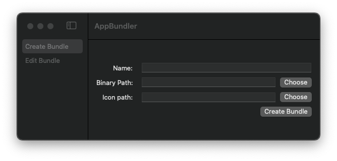
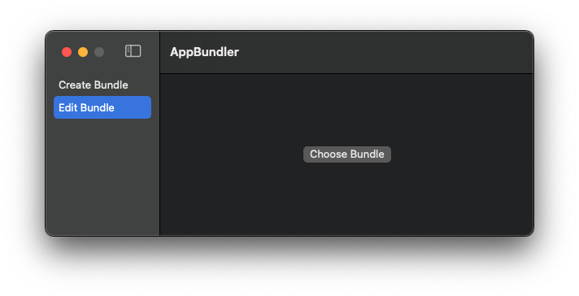
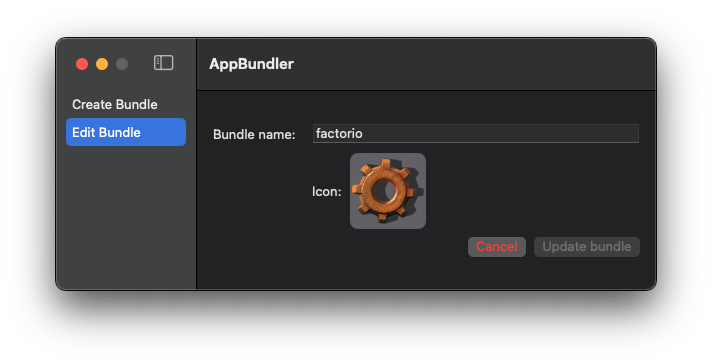

<h1 align="center">AppBundler</h1>

AppBundler is a simple MacOS program made with SwiftUI that creates a [standard bundle structure](https://developer.apple.com/documentation/bundleresources/placing_content_in_a_bundle) 
out of a MacOS binary or Java `.jar`, and optionally an icon. You can also inspect a bundle to 
change it's name.

### Create bundle

To create a bundle you need to simply provide the bundle name and either a native MacOS executable
or a Java `.jar` (If you're going to bundle a Java app, you'll need the Java runtime installed to 
open the app). 

The binary can be created in virtually any language that correctly generates native MacOS binaries 
so the system can execute it. Shell scripts and other interpreted languages (other than Java) are
not yet supported. You can optionally provide an image to your bundle that will be displayed on 
your Finder, Launchpad and Dock.

### Edit bundle

You can load any valid bundle and inspect/change it's name and image.

